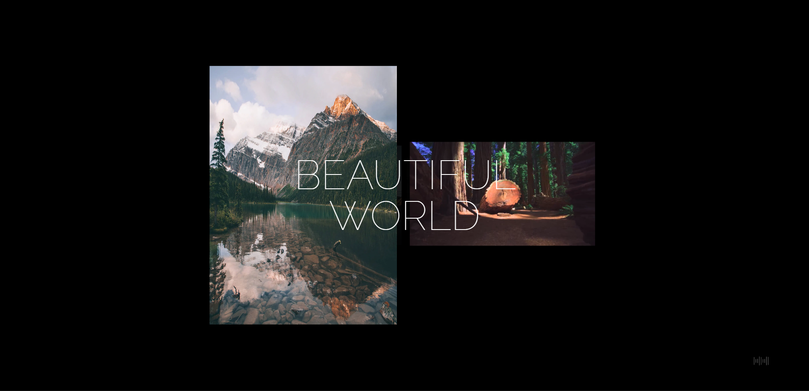

<!-- Project name -->

 

<h1 align="center">:seedling: Beautiful World :seedling:</h1>

  

    <a href="https://beautiful-world-dqew2rlyp-denyska-h.vercel.app/">View Demo</a>
    ·
    <a href="https://github.com/Denyska-H/Beautiful-World/issues">Report Bug</a>
  

<!-- About the project -->

## :bookmark_tabs: About The Project

Beautiful-World is landing page with responsive design and calm music for relaxing.

<!-- Technologies -->

## :technologist: Tech Stack Used

- HTML
- CSS
- SASS(SCSS)
- JS
- Gulp

<!-- CONTACT -->

## :phone: Contacts

Denys Hleba

- [Instagram](https://www.instagram.com/denys.life9)
- [Telegram](https://t.me/realgemba)
- [LinkedIn](https://www.linkedin.com/in/denys-hleba-853326176/)

(<a href="#top">back to top</a>)

